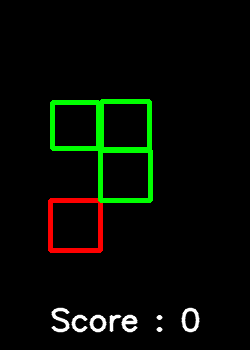

# Snake
Example of reinforcement learning using gym environment.

This project is inspired by Sentdex's tutorial https://www.youtube.com/watch?v=XbWhJdQgi7E.
The base code for the snake game comes from https://github.com/TheAILearner/Snake-Game-using-OpenCV-Python/blob/master/snake_game_using_opencv.ipynb.

